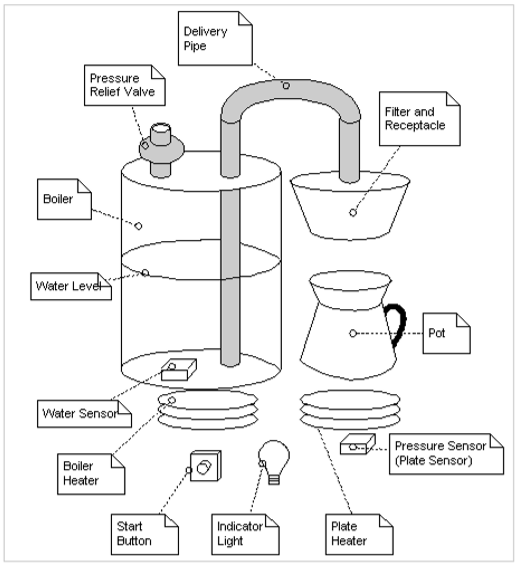

# at11-coffeeMaker

The Mark IV special makes up to 12 cups of coffee at a time. The user places a filter in the filter holder, fills the filter with coffee grounds, and slides the filter holder into its receptacle. The user then pours up to 12 cups of water into the water strainer and presses the "Brew" button. The water is heated until boiling. The pressure of the evolving steam forces the water to be sprayed over the coffee grounds, and coffee drips through the filter into the pot. The pot is kept warm for extended periods by a warmer plate, which only turns on if there is coffee in the pot. If the pot is removed from the warmer plate while coffee is sprayed over the grounds, the flow of water is stopped, so that brewed coffee does not spill on the warmer plate. The following hardware needs to be monitored or controlled. 
-	The heating element for the boiler. It can be turned on or off. 
-	The heating element for the warmer plate. It can be turned on or off. 
-	The sensor for the warmer plate. It has three states: warmerEmpty, potEmpty, and potNotEmpty. 
-	A sensor for the boiler, which determines if there is water present or not. It has two states: boilerEmpty or boilerNotEmtpy. 
-	The brew button. This momentary button starts the brewing cycle. It has an indicator that lights up when the brewing cycle is over and the coffee is ready. 
-	A pressure-relief valve that opens to reduce the pressure in the boiler. The drop in pressure stops the flow of water to the filter. It can be opened or closed.

